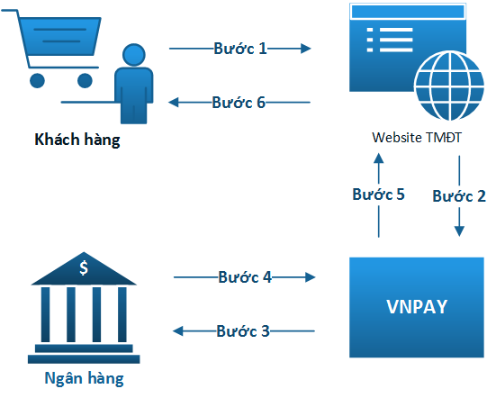

# Connection Model

- Bước 1: Khách hàng thực hiện mua hàng trên Website TMĐT và tiến hành Thanh toán trực tuyến cho Đơn hàng
- Bước 2: Website TMĐT thành lập yêu cầu thanh toán dưới dạng URL mang thông tin thanh toán và chuyển hướng khách hàng sang Cổng thanh toán VNPAY bằng URL đó.
Cổng thanh toán VNPAY xử lý yêu cầu Thanh toán mà Website TMĐT gửi sang. Khách hàng tiến hành nhập các thông tin được yêu cầu để thực hiện việc Thanh toán.
- Bước 3,4: Khách hàng nhập thông tin để xác minh tài khoản Ngân hàng của khách hàng và xác thực giao dịch.
- Bước 5: Giao dịch thành công tại Ngân hàng, VNPAY tiến hành:
Chuyển hướng khách hàng về Website TMĐT (vnp_ReturnUrl)
Thông báo cho Website TMĐT kết quả thanh toán của khách hàng thông qua IPN URL. Merchant cập nhật kết quả thanh toán VNPAY gửi tại URL này.
- Bước 6: Merchant hiển thị kết quả giao dịch tới khách hàng

---

Tạo URL Thanh toán

- URL Thanh toán là địa chỉ URL mang thông tin thanh toán. Website TMĐT gửi sang Cổng thanh toán VNPAY các thông tin này khi xử lý giao dịch thanh toán trực tuyến cho Khách mua hàng.

Code IPN URL

- Đây là địa chỉ để nhận kết quả thanh toán từ VNPAY. Kết nối hiện tại sử dụng phương thức GET
Trên URL VNPAY gọi về có mang thông tin thanh toán để căn cứ vào kết quả đó Website TMĐT xử lý các bước tiếp theo (ví dụ: cập nhật kết quả thanh toán vào Database …)

Code ReturnURL

- Dữ liệu VNPAY trả về bằng cách chuyển hướng trình duyệt web của khách hàng theo địa chỉ web mà Merchant cung cấp khi gửi yêu cầu thanh toán. Trên URL này mang thông tin kết quả thanh toán của khách hàng.

---

# Information for testing

| Ngân hàng      | NCB                 |
|----------------|---------------------|
| Số thẻ         | 9704198526191432198 |
| Tên chủ thẻ    | NGUYEN VAN A        |
| Ngày phát hành | 07/15               |
| Mật khẩu OTP   | 123456              |

---

